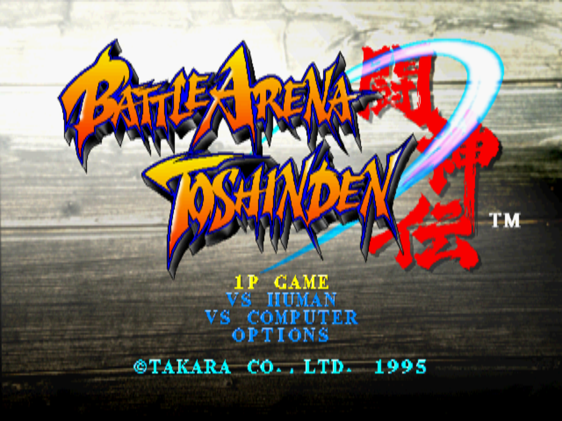
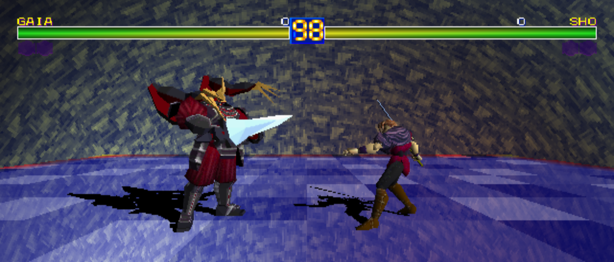
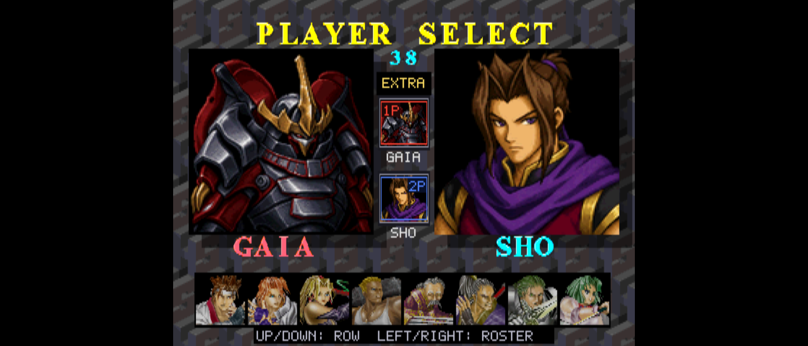
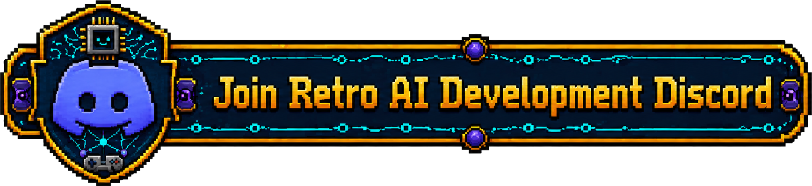

# Battle Arena Toshinden Recompiled

Static recompilation of **Battle Arena Toshinden (USA)**, PlayStation serial
**SCUS-94200**, to native code using [psxrecomp](https://github.com/mstan/psxrecomp)
and [recomp-ui](https://github.com/mstan/recomp-ui).

<p align="center">
  
</p>

*The original title screen, presented at its native 4:3 aspect ratio.*

## Status

**0.1.0 — Initial Release** is believed to be stable based on gameplay testing
and user validation, despite being an early release. Further testing and bug
reports are welcome; the validation notes describe the remaining limits.

The game boots through its introduction and character selection into combat.
The initial playable baseline was validated and approved for enhancements on
September 6, 2026. The launcher includes disc setup, settings, and a Mods page.
See [validation notes](validation/README.md) for the tested build and scope.

## Enhancements

**Battle Arena Toshinden Widescreen** offers fixed 16:9 and Adaptive. Adaptive
follows the current window or fullscreen aspect from 4:3 through 32:9, the
framework's current limit. Wider gameplay views reveal more of the stage;
health gauges extend to the perimeter while labels, icons, timer, and pause UI
retain their authored proportions. True 2D screens retain their 4:3 presentation.



*21:9 gameplay with adaptive widescreen enabled. The stage view expands while
characters, text, and icons retain their proportions.*

**Battle Arena Toshinden Frame Blending** presents completed game frames at
the display's measured refresh rate or a selected 60, 90, 120, 144, 165, or
240 Hz target. Motion-adaptive blending reduces trails on large image changes.
Game simulation, inputs, timers, and audio retain their original cadence.
This is temporal image blending, not motion-vector frame generation.

**Battle Arena Toshinden Extra Roster** adds Gaia and Sho as optional selectable
fighters. The normal eight-character roster stays in place as the bottom row;
Sho is the middle extra row and Gaia is the top extra row. Up cycles roster to
Sho to Gaia to roster, Down cycles roster to Gaia to Sho to roster, and
Left/Right only moves through the regular roster. The normal confirm button
starts the match through the game's selection path. The package uses new
generated portrait art; source details are documented in
[portrait sources and generation prompts](assets/mods/boss-roster/SOURCE.md).



*Gaia and Sho in the EXTRA column, with original-game-inspired mod portraits.
Up/Down moves between rows; Left/Right moves within the regular roster only.*

**Battle Arena Toshinden Desperation at Any Health** lets players perform
each character's normal desperation command at any health. It does not add a
one-button shortcut and does not change health, damage, KO handling, max HP, or
HUD gauges.

The shared framework also supplies standard enhancement packages, including
PGXP. Each package's description and options are available on the Mods page.
All title enhancements are optional and disabled by default.

## Playing

Download the **Windows ZIP** or **Linux x86_64 AppImage** from
[Releases](https://github.com/mstan/BattleArenaToshindenRecomp/releases/latest).
Extract the Windows package before running it. On Linux, make the AppImage
executable and launch it. These packages contain the compiled game runtime.

Select your legally obtained **USA BIN/CUE disc image** in the launcher, use
Generate & Build when prompted, and launch the game. Keep all 14 tracks beside
the CUE file so the game can play its CD audio.

The framework supplies MIT-licensed OpenBIOS. A supported retail BIOS dump is
optional; validation used SCPH1001. Disc images and retail BIOS files are not
included in this repository.

Enable enhancements on the launcher's **Mods** page. The title's widescreen,
frame blending, and optional gameplay packages are disabled by default. Saves and
mod selections are local to the installation.

## Layout

- `iso/` - local disc image and audio tracks, ignored by Git.
- `disc/` - extracted `SCUS_942.00` boot executable and disc files, ignored by Git.
- `seeds/` - function entry points used by the recompiler.
- `generated/` - generated native C, rebuilt locally and ignored by Git.
- `src/mods/` - title-specific native mod plugins.
- `mods/preloaded/` - bundled mod manifests and documentation.
- `psxrecomp/` and `recomp-ui/` - pinned framework and launcher submodules.
- `game.toml` - disc identity, compilation, and runtime configuration.

## Build

Initialize the pinned submodules, then use the framework's setup commands
from this directory with Python 3 and the supported RetComM toolchain:

```sh
git submodule update --init --recursive
python psxrecomp/psxrecomp_cli.py generate --config game.toml --project-root . --disc "iso/Battle Arena Toshinden (USA).cue"
python psxrecomp/psxrecomp_cli.py rebuild --config game.toml --project-root . --build-dir build-release --no-pgo
```

The Windows executable is `build-release/BattleArenaToshinden_Recompiled.exe`.
The launcher also exposes the same Generate & Build workflow. See the
[framework setup guide](psxrecomp/docs/GAME_PROJECT_SETUP.md) for prerequisites
and other platforms. SDL3 is the default host backend; SDL2 is an explicit
compatibility build option.

Submodule gitlinks are the authoritative framework versions. Generated code,
disc data, local settings, saves, and build output do not belong in commits.

Native release packaging follows the Tomba 2 / Mega Man X6 scripts:
`tools/package_release.ps1` produces the Windows ZIP and
`tools/package_appimage.sh` produces the Linux AppImage. Both read root `VERSION`
and stage clean player defaults from `packaging/release/`. Packaging requires
locally generated game code; it excludes disc data, retail BIOS files, and saves.

## Netplay

**Two-player rollback netplay is enabled**, using the shared recomp-net lobby
and transport. Open **NETPLAY** in the launcher to host or join an online room,
or use LAN / Direct IP. Each player configures their local controller under
**PLAYER 1 / NETPLAY**. Choose **VS HUMAN** in the game, or have P2 press Start
to join. Two standard digital controller ports are used; Multitap is disabled.

Both players need the same game build and the verified USA 14-track disc image.
Netplay runs a vanilla session: the framework disables mods, including the
widescreen, Extra Roster, frame blending, and desperation packages.

Validation covered two local peers in rollback mode, independent P1/P2 input,
character selection, and combat. All 416 sampled core-state hashes matched,
with no reported desyncs. Internet latency and NAT traversal have not yet been
tested for this title. See the [netplay guide](psxrecomp/docs/NETPLAY.md) for
connection options and the [validation notes](validation/README.md) for scope.

## License

No game disc data or retail PlayStation BIOS is redistributed here. OpenBIOS
is provided under its MIT license; see the framework's OpenBIOS license notice.
Launcher box art attribution is recorded in
[BOXART_SOURCE.txt](launcher_assets/img/BOXART_SOURCE.txt).

<!-- retcomm-readme-raid -->
---

<p align="center">
  <sub><b>R.A.I.D. - Retro AI Development</b> / a Discord for AI-assisted retro reverse-engineering, decomp &amp; recomp</sub>
</p>

<p align="center">
  <a href="https://discord.gg/Ad9BwSzctP"></a>
</p>
<!-- /retcomm-readme-raid -->
